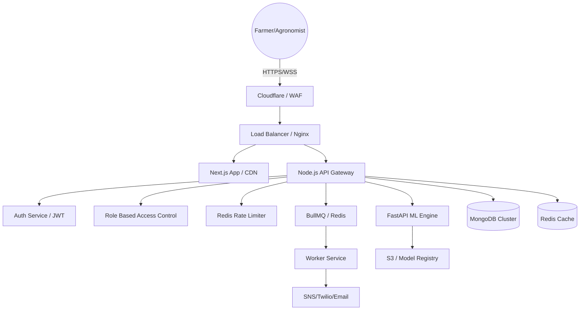

# Vision Driven Agro Diagnostic Framework - Production Architecture

## 1. System Overview
A high-performance, real-time AI SaaS platform for precision agriculture diagnosis. Built for scalability, low-bandwidth resilience, and enterprise-grade security.

## 2. Technical Stack
| Layer | Technology |
| :--- | :--- |
| **Frontend** | Next.js 15 (App Router), Tailwind CSS, Framer Motion, TanStack Query, Zustand |
| **Backend** | Node.js (Layered Architecture), Express.js, TypeScript |
| **ML Engine** | FastAPI, PyTorch, Torchvision, ONNX Runtime (Mobile optimization) |
| **Database** | MongoDB (Data persistence), Redis (Caching & Rate limiting) |
| **Infrastructure** | Docker, Nginx, GitHub Actions, AWS/GCP |
| **Monitoring** | Prometheus, Grafana, OpenTelemetry |

## 3. Production Architecture Diagram

## 4. Key SaaS Modules
- **Identity & Access**: Multi-tenant RBAC (Farmer, Agronomist, Organization Admin).
- **Diagnostic Engine**: Real-time image processing with XAI (Explainable AI) heatmaps.
- **Treatment Pipeline**: Logic-based recommendation engine for crop diseases.
- **Outbreak Analytics**: Geographic trend analysis and early warning systems.
- **Offline Sync**: PWA capabilities for rural areas with poor connectivity.

## 5. Deployment Workflow
1. **CI Phase**: GitHub Actions runs Lints, Unit Tests, and Security Scans (Snyk).
2. **Build Phase**: Multi-stage Docker builds optimize image size for Edge/Cloud.
3. **Registry**: Images pushed to ECR/GCR.
4. **CD Phase**: Blue-Green deployment to Kubernetes (EKS/GKE) via Helm/ArgoCD.
