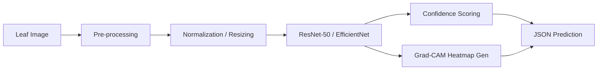

# AI/ML Inference & Training Pipeline

## 1. Inference Pipeline (Real-time)

### Components:
- **Pre-processing**: Noise reduction and auto-cropping to focus on the leaf.
- **Model Serving**: FastAPI with ONNX Runtime for low-latency CPU inference.
- **Explainability (XAI)**: Generation of activation maps to show farmers exactly where the disease was detected.
- **Confidence Thresholds**: Predictions < 85% are flagged for "Agronomist Review".

## 2. Model Training & Versioning
- **Dataset**: Utilizing PlantVillage and custom field datasets (100k+ images).
- **Versioning**: DVC (Data Version Control) for dataset tracking.
- **Experiment Tracking**: MLflow for hyperparameter logging.
- **Human-in-the-Loop**: Incorrect predictions are flagged by agronomists and added to the "Retraining Queue".

## 3. Monitoring & Drift
- **Input Monitoring**: Detect "Out of Distribution" (OOD) images (e.g., someone uploads a car instead of a leaf).
- **Performance Tracking**: Logging confidence scores over time to detect model degradation.

## 4. Edge Optimization Strategy
- **Quantization**: Int8 quantization for deployment on mobile browsers via ONNX.js.
- **Pruning**: Removing non-essential weights to reduce model size from 100MB to <15MB.
