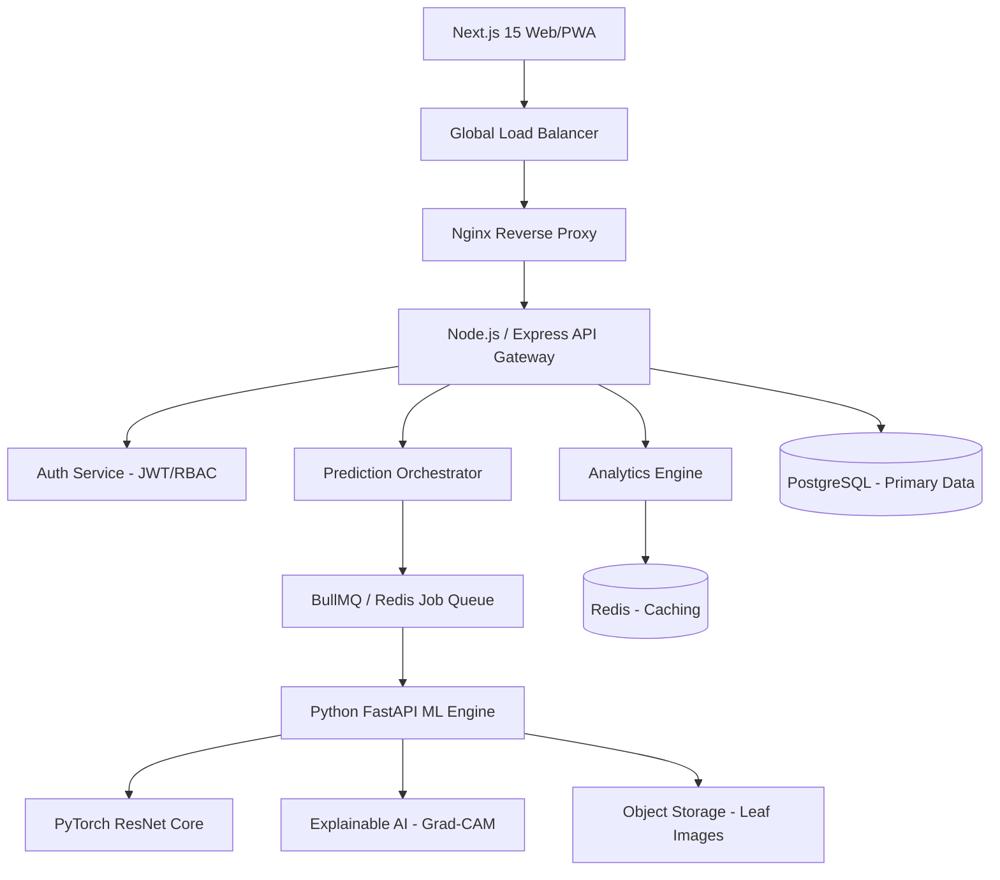

# Vision-Driven Agro Diagnostic Platform (VDAD)
## Comprehensive Technical Specification & Startup Blueprint

### 1. Executive Summary
VDAD is an enterprise-grade AI SaaS designed to bridge the gap between advanced computer vision and rural agricultural field-work. The platform provides real-time disease detection, explainable insights, and localized treatment recommendations.

### 2. System Architecture (The "Grand Design")


### 3. Core Component Definitions

| Component | Technology | Rationale |
| :--- | :--- | :--- |
| **Frontend** | Next.js 15, TypeScript, Tailwind | Unified SSR/Client components for SEO and speed. |
| **Backend** | Node.js (Layered Architecture) | High throughput for I/O bound notification and DB tasks. |
| **AI Engine** | Python 3.11, FastAPI, PyTorch | Industry standard for ML serving and Grad-CAM generation. |
| **Database** | PostgreSQL + Prisma ORM | Relational integrity for taxonomy and multi-tenant management. |
| **Cache/Queue** | Redis | sub-millisecond latency for sessions and background jobs. |

### 4. Database Schema Lifecycle (PostgreSQL)
- **Users**: Multi-tenant support (Farmer, Agronomist, Admin, Organization).
- **Taxonomy**: Hierarchical data for Crops -> Varieties -> Pathogens.
- **Diagnostics**: UUID-indexed table storing image metadata, AI confidence, and geospatial (PostGIS) data.
- **Treatments**: Integrated lookup for biological vs chemical interventions based on regional regulations.

### 5. AI Inference Pipeline Contract
`POST /ml/v1/predict`
- **Request**: `Multipart { file: Blob, mode: 'high_res' | 'mobile' }`
- **Response**:
    ```json
    {
      "prediction": "Potato Late Blight",
      "scientific_name": "Phytophthora infestans",
      "confidence": 0.985,
      "heatmap_url": "s3://.../heatmap_01.png",
      "metadata": { "inference_time": "120ms", "version": "resnet-v4.1" }
    }
    ```

### 6. DevOps & Scalability Strategy
- **Containerization**: Separate Dockerfiles for `Edge-Client`, `Core-API`, and `ML-Compute`.
- **CI/CD**: GitHub Actions for automated unit testing (Vitest/Pytest) and staging deployment.
- **Monitoring**: Prometheus/Grafana for model drift monitoring; Sentry for frontend error tracking.

### 7. Product Roadmap (MVP to Unicorn)
- **MVP (V1)**: Basic Upload -> Prediction -> Treatment flow.
- **Grow (V2)**: Offline-first PWA, Agronomist verification portal, PDF report generation.
- **Enterprise (V3)**: Regional outbreak heatmaps for governments, Satellite NDVI correlation.
